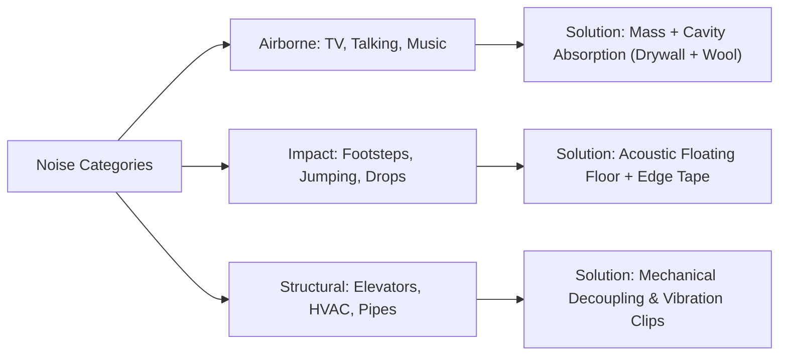

Unwanted neighbor noise is the single most common frustration for modern apartment and condo dwellers. Whether you live in a new concrete high-rise in Singapore, a wood-framed multi-family building in North America, or a refurbished European masonry apartment, hearing muffled conversations, heavy stomping from upstairs, or midnight TV shows ruins your peace of mind.

According to acoustic engineering field surveys, **over 80% of DIY soundproofing attempts fail completely**. Homeowners frequently waste thousands of dollars on paper-thin "miracle membranes," foam panels, or improper assemblies that violate basic acoustic physics.

In this comprehensive 2026 master guide, we break down apartment acoustics using architectural science, comparing **US standards (ASTM E90 / STC / IIC)** with **European & International norms (ISO 717 / DIN 4109 / Rw)**. You will learn how vibration decoupling works, how to build an authentic floating floor, how to soundproof walls without sacrificing excessive floor space, and how to integrate trending acoustic slat wood panels into your interior design.

---

## 1. Acoustic Physics: Why Sound Travels Through Walls and Floors

To stop noise, you must first identify the type of sound energy invading your living space:

1. **Airborne Noise** — Sound waves travel through the air, causing partitions to vibrate (voices, dog barking, TV, music). In the US, this is measured by **Sound Transmission Class (STC)**, while internationally it is rated as **Weighted Sound Reduction Index (Rw in dB)**. Higher numbers mean superior sound blocking.
2. **Impact Noise** — Direct mechanical vibration against the building structure (footsteps, high heels, bouncing balls, dropped objects, dragging furniture). Measured in the US by **Impact Insulation Class (IIC)** and internationally by **Normalized Impact Sound Level (Lnw in dB)**. For IIC, higher is better; for Lnw, lower dB means quieter for the downstairs neighbor.
3. **Flanking & Structural Noise** — Vibrations from elevators, HVAC pumps, water pipes, or subwoofers that travel through the rigid structural skeleton of the building and re-radiate into your room from adjacent walls and ceilings.



> [!IMPORTANT]
> **The Mass-Air-Mass (MAM) Principle**  
> Solid heavy walls only block sound through raw mass: doubling wall thickness adds merely +5 to +6 dB (STC points). An acoustic "sandwich" is far more efficient: a dense exterior board reflects sound waves, a porous mineral wool core dampens air cavity resonance, and a second heavy board arrests remaining sound energy.

---

## 2. Top 5 Fatal Soundproofing Mistakes & Useless DIY Materials

Before spending a dollar on materials, eliminate these widespread myths:

### Mistake 1. Gluing Expanded Polystyrene (Styrofoam / EPS) to Walls
Rigid foam board is an outstanding thermal insulator, but an **acoustic catastrophe**. Because of its rigid structural resonance frequency, polystyrene glued to a wall acts like a drum diaphragm, **amplifying human voice frequencies (250–800 Hz) by 5 to 12 dB!**

### Mistake 2. Installing Thin 1/8" to 1/4" (3–6 mm) Cork or "Nano-Membranes"
A thin sheet of cork under floating flooring helps reduce impact clicks for the neighbor below, but it provides **0 dB protection** against airborne voices coming through walls. Sound waves measuring several feet (meters) long cannot be stopped by a 1/8" (3 mm) layer.

### Mistake 3. Egg Cartons and Acoustic Foam Pyramids
Open-cell foam and egg cartons provide **sound absorption** (reducing echo and reverberation inside a podcast room), but have virtually **zero sound isolation** (sound passes right through into the neighbor's unit).

### Mistake 4. Rigid Framing Screwed Directly to Concrete/Studs
Fastening metal or wood studs directly into shared party walls creates direct structural bridges that transfer vibration straight through your drywall.

### Mistake 5. Treating Only One Wall in a Multi-Family Unit
Sound travels through indirect "flanking paths." If bass or voices enter your bedroom, the sound radiates not just from the shared party wall, but also from the connecting ceiling and side partitions.

---

## 3. Acoustic Floating Floors: Stopping Impact Noise at the Source

If you are performing a gut renovation, installing a decoupled floating floor is essential. It isolates footfall noise and blocks airborne transmission through the subfloor slab.


### Anatomy of an Engineered Floating Floor:

1. **Structural Subfloor**: Concrete slab or structurally reinforced plywood/OSB subfloor (thoroughly cleaned of debris).
2. **High-Density Acoustic Insulation Board**: Dense mineral wool or fiberglass board with a density of **6.2–8.7 lbs/cu ft (100–140 kg/m³)** and a thickness of **0.8"–1.2" (20–30 mm)**.
3. **Perimeter Edge Damping Tape**: Closed-cell foam or acoustic rubber tape wrapped along all walls higher than the top of the screed. **The finished floor and screed must never touch the perimeter walls directly!**
4. **Vapor Barrier & Protection Layer**: 6 mil (150–200 µm) reinforced polyethylene sheeting with taped overlapping seams to prevent wet screed slurry from penetrating into the acoustic batts.
5. **Reinforced Screed / Self-Leveling Layer**:
   * **US Standard**: Minimum **2.0"–2.4" (50–60 mm)** of fiber-reinforced mortar screed, or a high-strength self-leveling underlayment over acoustic sound mats.
   * **European / Asian Standard**: 2.4"–2.8" (60–70 mm) semi-dry cementitious screed reinforced with steel wire mesh.

> [!TIP]
> Calculate the exact bag count, sand, cement, and leveling mix needed for your room using our [interactive screed and leveling calculator](/calculators/screed).

---

## 4. Decoupled Wall Assemblies: Maximum STC with Minimal Footprint

To block noisy neighbors, an independent or decoupled wall assembly is the gold standard, adding **+15 to +22 STC points (Rw in dB)** over existing party walls.


### The High-Performance Acoustic Layer Stack:

```
[ Existing Party Wall / Studs ]
       │  ← 3/8"–1/2" (10–12 mm) Air Gap (Decoupled)
[ 2" (50 mm) Steel Studs + Acoustic Mineral Wool 2.8–3.7 lbs/cu ft (45–60 kg/m³) ]
       │
[ 1st Layer: 1/2" or 5/8" (12.5–15 mm) Dense Gypsum Fiber Board (High Mass) ]
       │  ← Green Glue Viscoelastic Damping Compound or Resilient Adhesive
[ 2nd Layer: 5/8" (15 mm) Type X Soundproof Acoustic Drywall (Staggered Joints) ]
       │
[ Perimeter: Non-hardening Acoustical Sealant around all edges ]
```

### Essential Craftsmanship Rules:
* **True Mechanical Decoupling**: Use **Resilient Sound Isolation Clips (RSIC / GenieClips)** or leave a 3/8" (10 mm) clear air gap between the new framing and the existing party wall.
* **Acoustic Edge Isolation**: Apply dual layers of closed-cell acoustic foam tape under the top and bottom track channels before anchoring to ceilings and floors.
* **Dissimilar Board Densities**: Combine high-density gypsum fiberboard (such as Fermacell or DensGlass) with acoustic drywall (such as QuietRock or Knauf Diamant). Combining different material densities eliminates coincident resonance dips.
* **Acoustical Caulk at All Perimeters**: Never use rigid joint compound or standard expanding spray foam at wall-to-floor junctions. Use non-hardening, permanently flexible acoustical sealant.

> [!TIP]
> Estimate your drywall sheets, metal tracks, screws, and compound with our [drywall and partition calculator](/calculators/drywall).

---

## 5. Sneaky Sound Leaks: Sealing Flanking Paths

A wall assembly is only as strong as its weakest acoustic seal. A 1% unsealed air gap can reduce a wall's soundproofing performance by up to 50%:

| Sound Leak Vulnerability | Why Sound Leaks Here | The Professional Solution |
| :--- | :--- | :--- |
| **Back-to-Back Electrical Outlets** | In multi-family buildings, electrical outlet boxes are often cut into the same stud cavity. | Stagger outlet boxes by at least 24" (600 mm). Wrap backboxes with moldable acoustic putty pads or install prefabricated sound-rated outlet boxes. |
| **Radiator & Plumbing Pipe Sleeves** | Metal pipes pass through oversized core-drilled holes in concrete slabs. | Chisel away cracked mortar, wrap pipes with dense acoustic rubber or mineral wool sleeves, and seal gaps with fire-rated elastomeric acoustical caulk. |
| **Perimeter Expansion Gaps** | Floating wood floors need expansion gaps, which can act as sound channels. | Use acoustic perimeter backing cords under baseboards. Check out our guide on [shadow gaps and micro-baseboards](/posts/shadow-gap-and-micro-baseboards-2026). |
| **HVAC & Ventilation Ducts** | Ductwork acts as a natural speaking tube between adjoining rooms. | Install in-line acoustic duct silencers and use insulated flexible duct runs with at least two 90-degree bends. |

---

## 6. 2026 Design Trends: Acoustic Slat Wood Panels

In 2026, acoustic comfort meets high-end architectural aesthetics. The most dominant trend in modern living rooms and master suites is the integration of **3D Acoustic Slat Wood Panels**.


### Why Designers and Architects Love Them:
* **Dual Functionality**: Premium natural white oak or American walnut veneers add warmth and organic texture, while the high-density recycled **PET acoustic felt backing (0.35" / 9 mm thick)** absorbs mid-to-high frequency reflections (NRC approx. 0.85), eliminating room flutter echo.
* **Perfect for Work-from-Home & Media Rooms**: Drastically improves vocal clarity during video conferences and enhances home theater acoustics.
* **Rapid Clean Installation**: Panels mount directly to drywall using high-grab adhesive or black drywall screws through the felt within a few hours.

---

## 7. Comparative Performance Table: Thickness vs Noise Reduction

| Soundproofing Assembly | Total Thickness | STC / Rw Improvement | Approx. Cost / sq ft (sq m) | Best Application |
| :--- | :--- | :--- | :--- | :--- |
| **Direct-to-Stud Resilient Channels + Damping** | 1.75"–2.25" (45–55 mm) | +8 to +12 dB | 4–7 USD / sq ft (45–75 USD/m²) | Low-profile upgrade for drywall walls with moderate voice noise |
| **Independent 2" Stud Wall (Air Gap + Dual Board)** | 3.0"–3.5" (75–90 mm) | +15 to +19 dB | 8–14 USD / sq ft (85–150 USD/m²) | Shared bedroom party walls, noisy neighbors, home offices |
| **Heavy Staggered Stud / Double Wall System** | 4.5"–6.0" (115–150 mm) | +20 to +25 dB | 15–24 USD / sq ft (160–260 USD/m²) | Home theaters, vocal studios, walls adjoining elevator shafts |
| **Acoustic Floating Floor with Mineral Mat** | 2.75"–3.25" (70–85 mm) | Impact isolation up to 28–34 dB | 6–11 USD / sq ft (65–120 USD/m²) | Essential for condos and apartments to stop footstep complaints |

---

## ❓ FAQ

**Can I effectively soundproof an apartment with only 1/2 inch (12 mm) of space?**  
No. Sound waves in the human vocal and bass frequency range are several feet (meters) in length. To absorb and dissipate that acoustic energy, an effective assembly requires a minimum of 1.75" to 2.0" (45–50 mm) of depth to accommodate a resilient air gap, acoustic absorption batts, and high-mass gypsum layers. Ultra-thin membranes only add mass to an already heavy wall and will not stop airborne conversations by themselves.

**Will soundproofing my ceiling stop footstep noise from the upstairs neighbor?**  
Impact noise (heavy footsteps, heel drops) is best controlled at the source—on top of the floor above. If you cannot access the upstairs unit, installing an isolated ceiling on heavy-duty resilient sound clips (RSIC-1 / GenieClips) packed with 3" (75 mm) mineral wool and two layers of 5/8" (15 mm) drywall with damping compound will reduce footstep thump by roughly 40% to 60%, and completely eliminate airborne voices and TV audio.

**Which insulation is better for soundproofing: Rockwool (mineral wool) or Fiberglass?**  
Both materials perform exceptionally well if selected in the correct density range. The optimal density for acoustic cavity dampening is **2.8 to 3.7 lbs/cu ft (45 to 60 kg/m³)** (such as Rockwool Safe'n'Sound or high-density acoustic fiberglass). Low-density thermal insulation (1.0 lb/cu ft) is too light to absorb lower frequencies, while ultra-dense rigid facade boards (>6.0 lbs/cu ft) can physically bridge vibrations across the cavity.

**Why shouldn't I use regular expanding spray foam for acoustic gaps?**  
Standard polyurethane expanding foam cures into a stiff, closed-cell matrix. Once hardened, it acts as an acoustic bridge, transmitting structural vibrations directly between building elements. Always use non-hardening, permanently elastic acoustical caulk or silicone-based acoustic sealants.

**What is the correct order of soundproofing during a total remodel?**  
The standard acoustic sequence is:
1. Pour the acoustic floating floor screed on perimeter damping tape.
2. Build decoupled wall framing standing on the floating floor (isolated via damping strips).
3. Install the acoustic ceiling on resilient isolation clips, sealing all perimeter junctions with acoustical caulk.

---

## Summary

Achieving genuine silence in your apartment in 2026 relies on proven building physics:
1. **Mass & Dissimilarity** (heavy layers of dense gypsum fiberboard and soundproof drywall).
2. **Cavity Absorption** (properly spec'd mineral wool batts at 2.8–3.7 lbs/cu ft / 45–60 kg/m³).
3. **Mechanical Decoupling** (resilient isolation clips, perimeter damping tape, and flexible acoustic sealants).

Follow these principles to transform your home into a quiet, peaceful sanctuary insulated from the chaotic noise of city life.
