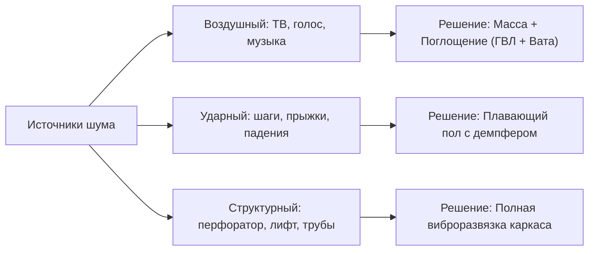

Шум от соседей — главная скрытая боль жителей современных многоквартирных домов. Будь то монолитно-каркасная новостройка, панельный дом или исторический фонд, вы наверняка слышали разговоры за стеной, грохот каблуков сверху или ночную музыку. 

По статистике акустических инженеров, до **85% людей**, делающих шумоизоляцию самостоятельно, выбрасывают деньги на ветер. Причина — вера в строительные мифы, покупка бесполезных «чудо-мембран» толщиной 3 мм и грубое нарушение законов физики.

В этом руководстве мы разберем акустику квартиры с точки зрения строительной науки, международных стандартов **DIN 4109** / **ISO 717** и нормативов **СП 51.13330**. Вы узнаете, как работает виброразвязка, как собрать настоящий «плавающий» пол, звукоизолировать стены без потери драгоценных квадратных метров и интегрировать трендовые акустические рейки в интерьер 2026 года.

---

## 1. Физика шума: почему звук проходит сквозь бетон

Чтобы победить шум, нужно понимать, с каким типом звуковой энергии вы боретесь:

1. **Воздушный шум (Airborne Noise)** — звуковые волны передаются по воздуху и заставляют вибрировать перегородку (крики, лай собак, телевизор, смех). Измеряется индексом изоляции воздушного шума **Rw** (в США — **STC, Sound Transmission Class**). Чем выше значение, тем лучше.
2. **Ударный шум (Impact Noise)** — прямое механическое воздействие на конструкцию перекрытия (шаги на каблуках, топот детей, падение предметов, передвижение мебели). Измеряется уровнем приведенного ударного шума **Lnw** (в США — **IIC, Impact Insulation Class**). Здесь, наоборот, чем ниже индекс в дБ, тем тише у соседей снизу.
3. **Структурный (вибрационный) шум** — работа перфоратора, лифтовой лебедки, насосов водоснабжения или кондиционера. Колебания распространяются по всему жесткому железобетонному скелету здания на десятки метров.



> [!IMPORTANT]
> **Золотой закон акустики: принцип «Масса — Упругость — Масса» (MAM)**  
> Однородная тяжелая стена гасит звук только за счет массы (удвоение веса стены дает всего +5–6 дБ защиты). Акустический сэндвич работает эффективнее: плотная внешняя облицовка (масса) отражает волну, волокнистый заполнитель (упругость/поглотитель) переводит колебания воздуха в тепло, а вторая тяжелая обшивка гасит остаток.

---

## 2. Топ-5 фатальных ошибок и бесполезных материалов

Перед тем как закупать материалы, забудьте про эти опасные заблуждения:

### Ошибка 1. Монтаж пенопласта или ЭППС на стены для «тишины»
Пенополистирол (пенопласт) — великолепный теплоизолятор, но **акустическая катастрофа**. Из-за своей упругоструктурной резонансной частоты жесткий пенопласт, приклеенный к стене и оштукатуренный, образует колебательный контур, который **усиливает слышимость голосового диапазона (200–800 Гц) на 5–12 дБ!**

### Ошибка 2. Тонкая пробка или тонкие «нано-мембраны» 3–5 мм на голый бетон
Никакой материал толщиной 3–5 мм (0.12–0.2 дюйма) не способен остановить звуковую волну с длиной в несколько метров. Пробка под ламинатом снижает только ударный шум для соседа снизу, но от криков соседей за стеной она защищает ровно на 0 дБ.

### Ошибка 3. Яичные лотки и акустический поролон «пирамидка»
Поролон и лотки являются материалами **звукопоглощения** (убирают эхо и реверберацию внутри самой комнаты), но не обладают **звукоизоляцией** (не мешают звуку пройти к соседям).

### Ошибка 4. Жесткое крепление металлопрофилей к несущим стенам
Если прикрутить металлический профиль напрямую к плите без виброподвесов и демпферной ленты, профиль станет прямым мостиком передачи структурной вибрации.

### Ошибка 5. Звукоизоляция только одной стены в комнате
В монолитных домах звук распространяется косвенным путем (flanking transmission). Если сосед громко слушает музыку, звук идет не только через стену, но и переизлучается тонкими перегородками, плитой пола и потолка.

---

## 3. Плавающий пол: фундаментальная защита от ударного шума

Если вы делаете капитальный ремонт, плавающий пол — это святая обязанность. Без него любой шаг по ламинату будет эхом отдаваться у соседей снизу, а шум от их телевизора будет легко проникать к вам через перекрытие.


### Анатомия правильного плавающего пола:
1. **Железобетонная плита перекрытия** (очищенная от строительного мусора и пыли).
2. **Специализированные акустические плиты высокой плотности** (например, базальтовые плиты 100–140 кг/м³ толщиной 20–30 мм / 0.8–1.2 дюйма).
3. **Кромочная вибродемпферная лента** по всему периметру стен на высоту выше будущей стяжки. Стяжка **ни в коем случае не должна касаться стен**!
4. **Гидроизоляционная армированная полиэтиленовая пленка** плотностью от 150–200 мкм с проклейкой нахлестов скотчем (чтобы цементное молочко не протекло в акустическую вату и не создало звуковые мостики).
5. **Армированная цементно-песчаная или полусухая стяжка** толщиной **не менее 50–60 мм (2.0–2.4 дюйма)** с фиброволокном и металлической сеткой. Меньшая толщина стяжки по упругому основанию растрескается под нагрузкой.

> [!TIP]
> Рассчитать точный объем цемента, песка, акустических плит и смеси для вашей площади вы можете в нашем [интерактивном калькуляторе стяжки пола](/ru/calculators/screed).

---

## 4. Каркасная звукоизоляция стен: тишина без компромиссов

Каркасная независимая облицовка — это эталон защиты от воздушного шума. Она добавляет к существующей стене от **+14 до +22 дБ** реальной звукоизоляции.


### Пошаговый пирог эффективной облицовки:

```
[ Существующая стена ]
       │  ← Воздушный зазор 10 мм (0.4 in)
[ Каркас 50 мм (2 in) на виброподвесах + Акустическая вата 45–60 кг/м³ ]
       │
[ 1-й слой: Гипсоволокнистый лист ГВЛ 12.5 мм (высокая плотность/масса) ]
       │  ← Эластичный виброакустический герметик на стыках
[ 2-й слой: Акустический гипсокартон ГКЛ 12.5 мм (с разбежкой швов) ]
```

### Главные технологические правила:
* **Никакого жесткого крепежа к стене**: стойки каркаса монтируются либо с относом в 10 мм без связи со стеной (при высоте до 3 м), либо через специализированные **виброизолирующие подвесы** с полиуретановым эластомером (Sylomer).
* **Демпферная лента**: все направляющие профили (ПН), примыкающие к полу, потолку и боковым стенам, проклеиваются виброгасящей лентой в два слоя.
* **Разнородные материалы обшивки**: первый слой — плотный и вязкий ГВЛ (1200 кг/м³), второй слой — утяжеленный акустический ГКЛ. Разная плотность материалов исключает совпадение критических резонансных частот.
* **Нетвердеющий акустический герметик**: щели по периметру между гипсокартоном и смежными стенами заполняются специальным виброакустическим силиконовым герметиком, а не обычной монтажной пеной (пена отлично проводит звук!).

> [!TIP]
> Для точного расчета профилей, листов ГКЛ/ГВЛ и крепежа воспользуйтесь нашим [калькулятором перегородок и гипсокартона](/ru/calculators/drywall).

---

## 5. Скрытые звуковые мостики: где звук просачивается втихаря

Даже самая дорогая звукоизоляция стен потеряет 50% эффективности, если не устранить скрытые каналы утечки звука:

| Узел утечки звука | В чем проблема? | Как правильно изолировать? |
| :--- | :--- | :--- |
| **Сквозные розетки** | В панельных домах ниши розеток между соседями часто сквозные. | Демонтировать подрозетник, заделать сквозную дыру цементным раствором или базальтовой плитой, установить специализированные акустические подрозетники. |
| **Стояки отопления** | Трубы жестко замурованы в плиту или проходят через пустые гильзы. | Разбить старый раствор вокруг трубы, обернуть трубу вибродемпферной лентой или минеральным шнуром, загерметизировать термостойким виброгерметиком. |
| **Стыки плит и трещины** | В новостройках швы между монолитом и пеноблоком часто запенены монтажной пеной. | Вырезать пену на глубину 30–50 мм (1.2–2.0 in), плотно зачеканить безусадочным цементным составом, залить эластичным герметиком. |
| **Вентиляционные каналы** | Звук переносится по воздушному коробу как по переговорной трубе. | Установка трубчатых шумоглушителей и акустических вентиляционных решеток. |

---

## 6. Тренды 2026: интерьерные акустические панели

В дизайне интерьеров 2026 года акустический комфорт объединяется с эстетикой. Самый заметный тренд последних выставок в Милане и Париже — **акустические реечные 3D-панели (Acoustic Slat Wood Panels)**.


### Почему это хит современного ремонта:
* **Двойная польза**: шпонированные натуральным дубом или орехом рейки создают премиальный визуальный акцент, а основа из плотного переработанного акустического войлока (PET) поглощает средние и высокие частоты, полностью устраняя гулкость и эхо в комнате.
* **Идеально для домашних офисов и медиазон**: значительно улучшает разборчивость речи на созвонах и чистоту звучания домашнего кинотеатра.
* **Простой монтаж**: панели монтируются на жидкие гвозди или саморезы прямо поверх финишной отделки за несколько часов.

---

## 7. Сравнительная таблица решений: толщина vs эффективность

| Система звукоизоляции | Толщина конструкции | Прибавка к Rw (изоляция шума) | Примерная стоимость за 1 м² | Оптимальное применение |
| :--- | :--- | :--- | :--- | :--- |
| **Бескаркасная сэндвич-панель (ЗИПС)** | 40–55 мм (1.6–2.2 in) | +9...12 дБ | Средняя | Ровные стены, защита от обычного бытового разговора и телевизора |
| **Каркасная облицовка на относе (50 мм)** | 75–85 мм (3.0–3.4 in) | +15...19 дБ | Средняя/Высокая | Спальни, детские, стены с шумными соседями |
| **Усиленный акустический каркас (75 мм)** | 100–115 мм (4.0–4.5 in) | +20...24 дБ | Высокая | Домашние кинотеатры, студии, смежные стены с лифтовыми шахтами |
| **Плавающий пол по акустической вате** | 70–80 мм (2.8–3.2 in) | Снижение ударного шума до 28–34 дБ | Средняя | Полная защита соседей снизу от топота и защита вашей квартиры от шума |

---

## ❓ FAQ

**Можно ли сделать качественную звукоизоляцию толщиной всего 1–2 сантиметра?**  
Нет, законы физики обмануть невозможно. Звуковая волна человеческого голоса имеет длину около 1–2 метров. Чтобы рассеять и поглотить такую энергию, требуется система толщиной минимум 45–50 мм (1.8–2.0 дюйма), сочетающая упругий слой (акустическую вату) и массивную плотную обшивку (ГВЛ+ГКЛ). Тонкие мембраны работают только как утяжелитель в составе толстого многослойного пирога.

**Защитит ли натяжной потолок со звукоизоляцией от топота соседей сверху?**  
От ударного шума (топота, падения предметов) на 100% защищает только плавающий пол у соседа сверху. Со стороны вашей квартиры подвесной потолок на виброподвесах с акустической ватой плотностью 45–60 кг/м³ и обшивкой ГВЛ+ГКЛ снизит топот на 40–60% и полностью уберет воздушный шум (разговоры, музыку). Обычное полотно натяжного потолка с ватой без жесткой массивной обшивки ударный шум не задержит.

**Какой материал лучше для заполнения каркаса: базальтовая вата или стекловата?**  
Оба материала отлично работают при условии правильной плотности. Для звукоизоляции оптимальна плотность 40–60 кг/м³ (2.5–3.7 lbs/cu ft). Слишком легкая утеплительная вата (15–20 кг/м³) плохо поглощает звук, а сверхплотная фасадная вата (более 90 кг/м³) начинает передавать вибрацию через волокна.

**Почему нельзя запенивать щели обычной монтажной пеной при звукоизоляции?**  
Монтажная пена после высыхания становится жесткой структурой с закрытыми порами. Она работает как резонатор и передает акустические колебания с одной конструкции на другую. Все стыки и технологические швы в звукоизоляции должны заполняться нетвердеющим виброакустическим силиконовым герметиком.

**В каком порядке делать звукоизоляцию в квартире: пол, стены или потолок?**  
Классический профессиональный порядок: сначала заливается звукоизоляционный плавающий пол, затем на него (через демпферную ленту) монтируются каркасы звукоизоляции стен, и в последнюю очередь собирается звукоизоляционный потолок (либо потолок на виброподвесах монтируется перед стенами с примыканием облицовок стен к потолку через виброразвязку).

---

## Итог

Качественная звукоизоляция в 2026 году — это не магия и не дорогие чудо-материалы, а строгое следование трем правилам:
1. **Масса и неоднородность** (тяжелые листы ГВЛ + акустический ГКЛ разной плотности).
2. **Поглощение** (профессиональные минераловатные плиты плотностью 45–60 кг/м³).
3. **Виброразвязка** (демпферные ленты, виброподвесы, плавающая стяжка и безусадочные герметики).

Соблюдая эту технологию, вы превратите свою квартиру в настоящий оазис тишины и уюта, где не слышно ни соседей, ни уличного шума.
