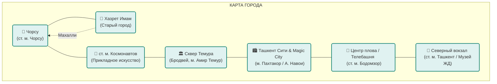

# Вояж в Ташкенте: Восточный Модерн 🇺🇿

*Современный путеводитель по столице Узбекистана, адаптированный под ваш график (2–5 июля 2026 года).*

```
   🕌 ═══ 🍲 ═══ 🛍️ ═══ 🚂
   Сплетение Шелкового пути и современного мегаполиса
```

---

## ☀️ Прогноз погоды в Ташкенте (2–5 июля)

Лето в Ташкенте жаркое и солнечное. На ваши даты прогнозируется комфортная (по меркам летнего Узбекистана) погода. Рекомендуется носить легкую одежду из натуральных тканей, пользоваться солнцезащитным кремом (UV-индекс высокий) и всегда иметь при себе бутылку воды.

| Дата | Погода | Температура (День / Ночь) | Рекомендации |
| :--- | :--- | :--- | :--- |
| **2 июля (Четверг)** | ☀️ Ясно, без осадков | **+28°C** / +21°C | Идеально для позднего вечернего трансфера |
| **3 июля (Пятница)** | ☀️ Солнечно и сухо | **+30°C** / +22°C | Днем спасайтесь в тени махалли или музее |
| **4 июля (Суббота)** | ☀️ Жарко, безветренно | **+32°C** / +23°C | В полдень лучше находиться в ТРЦ или парке |
| **5 июля (Воскресенье)** | ☀️ Очень солнечно | **+33°C** / +24°C | Утром — прогулка, днем — поезд с кондиционером |

---

## 📌 Практический минимум для путешественника

* **🏨 Ваш отель:** **ART Zarbog Hotel** (ул. Зарбог, 7). Ссылка на [Google Maps Location](https://www.google.com/maps/search/?api=1&query=ART+Zarbog+Hotel+Tashkent). Гостиница находится в тихом, зеленом и престижном дипломатическом районе города.
* **💸 Валюта:** Узбекский сум (UZS). Курс примерно **$1 ≈ 12 000 сум**. В ходу наличные, особенно на рынках. В ТРЦ и ресторанах принимают карты (Humo, Uzcard, Visa/Mastercard). Обменники есть во всех крупных банках и отелях.
* **📱 Связь:** Туристическую SIM-карту от [Mobiuz](https://mobiuz.uz/), [Ucell](https://ucell.uz/) или [Beeline](https://beeline.uz/) можно купить в аэропорту или офисах в городе. Потребуется загранпаспорт.
* **🚖 Такси:** Пользуйтесь приложением [Yandex Go](https://go.yandex/) (скачайте для [App Store](https://apps.apple.com/app/yandex-go-taxi-delivery/id1248556687) или [Google Play](https://play.google.com/store/apps/details?id=ru.yandex.taxi)). Поездки очень дешевые (**12 000 – 25 000 сум / около $1.00 – $2.00** за поездку по центру). Переключите оплату на наличные, если нет иностранной карты.
* **🚆 Поезда:** Все билеты на внутренние поезда (включая скоростные «Афросиаб») и международные рейсы бронируйте на официальном портале [Uzbekistan Railways](https://eticket.uzrailway.uz/).
* **🚰 Вода:** Пейте исключительно покупную бутилированную воду.

---

## 🗺️ Карта ключевых локаций

Схема основных мест привязанных к станциям метро Ташкента:



---

## 🕌 Топ-5 мест Ташкента

### 1. Исторический комплекс Хазрет Имам & Центр исламской цивилизации
Духовное сердце столицы. Здесь старинные бирюзовые купола медресе соседствуют со строящимся грандиозным [Центром исламской цивилизации](http://islamiccenter.uz/), куда перенесен знаменитый **Коран Усмана** (VII век) — древнейшая рукопись в мире. Вход на территорию комплекса **бесплатный**.
* *Карта:* [Google Maps Location](https://www.google.com/maps/search/?api=1&query=Hazrati+Imam+Complex+Tashkent)
* *Подробнее:* [Хазрет Имам на Uzbekistan Travel](https://www.advantour.com/rus/uzbekistan/tashkent/khazret-imam.htm)


### 2. Рынок Чорсу (Chorsu Bazaar)
Уникальный купольный базар, воплощающий дух древнего Востока. Здесь продают специи, горы сухофруктов, расписную посуду. Рядом находятся «обжорные ряды» с традиционным стрит-фудом. Вход **бесплатный**.
* *Карта:* [Google Maps Location](https://www.google.com/maps/search/?api=1&query=Chorsu+Bazaar+Tashkent)
* *Подробнее:* [Рынок Чорсу на Uzbekistan Travel](https://www.advantour.com/rus/uzbekistan/tashkent/chorsu-bazaar.htm)


### 3. Станции метро «Космонавтов» и «Алишер Навои»
Подземные дворцы Ташкента. «Космонавтов» оформлена в глубоких космических тонах с портретами покорителей космоса, а «Алишер Навои» украшена куполами и барельефами. 
* *Стоимость проезда:* **3 000 сум (около $0.25)** при покупке разового бумажного QR-билета за наличные, либо всего **1 700 сум (около $0.14)** при оплате любой бесконтактной банковской картой прямо на турникете.
* *Маршруты и схема:* [Яндекс Метро Ташкент](https://yandex.ru/metro/tashkent)


### 4. Сквер Амира Темура и улица Бродвей
Символический центр города с памятником Тамерлану. Рядом стоит легендарная бруталистская гостиница «Узбекистан» и начинается пешеходная аллея художников и уличных музыкантов Сайилгох (Бродвей). Прогулки **бесплатны**.
* *Карта:* [Google Maps Location](https://www.google.com/maps/search/?api=1&query=Amir+Timur+Square+Tashkent)

### 5. Парки Tashkent City и Magic City
Современная парковая зона с искусственным озером, музыкальным шоу фонтанов и сказочным замком развлечений в Magic City. Вход в оба парка и просмотр шоу фонтанов абсолютно **бесплатные**.
* *Карты:* [Tashkent City Park (Google)](https://www.google.com/maps/search/?api=1&query=Tashkent+City+Park) | [Magic City (Google)](https://www.google.com/maps/search/?api=1&query=Magic+City+Tashkent)
* *Сайты парков:* [Magic City](https://magiccity.uz/) | [Tashkent City](https://www.instagram.com/tashkentcitypark/)


---

## 🍲 Национальная кухня и бюджетные гастро-точки

Узбекская кухня — это гастрономический праздник. Попробуйте плов, самсу, манты и лагман в проверенных недорогих местах.


* **🍲 Легендарный Плов:**
  * **[Besh Qozon (Центр плова)](https://www.google.com/maps/search/?api=1&query=Besh+Qozon+Tashkent):** Главное место паломничества любителей плова у Телебашни. Огромная порция стоит всего **45 000 – 55 000 сум (около $3.80 – $4.70)**. *Приходить строго с 11:30 до 14:00.*
  * **[Komolon Osh (Комолон Ош)](https://www.google.com/maps/search/?api=1&query=Komolon+Osh+Tashkent):** Менее туристическое, но обожаемое местными кафе с аутентичным темным чайханским пловом. Порция стоит **40 000 – 48 000 сум (около $3.30 – $4.00)**.
* **🥐 Легендарная Самса:**
  * **[Minor Somsa](https://www.google.com/maps/search/?api=1&query=Minor+Somsa+Tashkent):** Лучшая слоеная самса из тандыра у мечети Минор. Стоимость одной штуки — **8 000 – 12 000 сум (около $0.70 – $1.00)**.
  * **[Ko'kcha Somsa](https://www.google.com/maps/search/?api=1&query=Kokcha+Somsa+Tashkent):** Классическая мясная самса в старом районе Кукча. Стоимость: **7 000 – 10 000 сум (около $0.60 – $0.80)**.
* **🥟 Манты, Шашлык и Лагман:**
  * **Кафе «National Food»:** Огромная столовая с национальной едой напротив Цирка (м. Гафур Гулом). Попробуйте манты, нарын и домашнюю колбасу хасип. Ссылка на [карту Google](https://www.google.com/maps/search/?api=1&query=National+Food+Tashkent). Средний чек — **30 000 – 45 000 сум (около $2.50 – $3.70)**.
  * **Сеть «Gijduvon»:** Доступные Bukharian-style кафе (например, [филиал в Google Maps](https://www.google.com/maps/search/?api=1&query=Gijduvon+Tashkent)). Специализация — сочные молотые шашлыки, лагман и манты. Средний чек — **35 000 – 50 000 сум (около $3.00 – $4.20)**.
  * **Сеть «Rayhon Milliy Taomlari»:** Самая известная сеть недорогих ресторанов национальной кухни с огромным выбором и молниеносным обслуживанием. Ссылка на [карту Google](https://www.google.com/maps/search/?api=1&query=Rayhon+Milliy+Taomlari+Tashkent) и [официальный сайт](http://rayhonmilliy.uz/). Средний чек — **25 000 – 40 000 сум (около $2.00 – $3.30)**.
  * **Обжорные ряды рынка Чорсу:** Максимально спартанская, но культовая точка уличной еды. Попробуйте рулет ханум за **6 000 сум (около $0.50)**.
* **🌯 Местный Фастфуд и Перекус:**
  * **Сеть «Oqtepa Lavash»:** Популярный местный фастфуд. Их фирменный говяжий или куриный лаваш (в лаваше с соусом, чипсами и сыром) стоит всего около **26 000 сум (около $2.10)** и готовится за 5 минут. Ссылка на [карту Google](https://www.google.com/maps/search/?api=1&query=Oqtepa+Lavash+Tashkent).
* **🍰 Кофе и Десерты:**
  * **Сеть кондитерских «Safia Cafe & Bakery»:** Крупнейшая местная сеть чистых и стильных кофеен с европейским дизайном. Идеальное место для легкого завтрака, свежих сэндвичей, кофе и десертов по отличным ценам. Ссылка на [карту Google](https://www.google.com/maps/search/?api=1&query=Safia+Cafe+and+Bakery+Tashkent). Кофе с десертом обойдутся в **30 000 – 45 000 сум (около $2.50 – $3.70)**.

---

## 🛍️ Современные торговые центры

* **[Tashkent City Mall](https://tcmall.uz/) ([Карта Google](https://www.google.com/maps/search/?api=1&query=Tashkent+City+Mall)):** Самый масштабный ТРЦ в стране. Все мировые бренды одежды (Zara, Massimo Dutti и др.), рестораны, IMAX-кинотеатр, каток. Вход **бесплатный**.
* **[Samarqand Darvoza](https://sdmall.uz/) ([Карта Google](https://www.google.com/maps/search/?api=1&query=Samarqand+Darvoza+Tashkent)):** Популярный семейный ТРЦ на улице Караташ с огромным фуд-кортом. Вход **бесплатный**.
* **[NEXT Mall](https://www.instagram.com/next_mall/) ([Карта Google](https://www.google.com/maps/search/?api=1&query=NEXT+Mall+Tashkent)):** ТРЦ на улице Бабура с кинотеатром, фуд-кортом и детским научным парком. Вход **бесплатный**.

---

## 📅 Персональный маршрут: Ташкент день за днем

### 🗓️ 2 июля (Четверг) — Прилет и вечерняя прохлада
* **21:30** — Прилет в Ташкент, паспортный контроль, оформление туристической SIM-карты в зале прилета.
* **22:30** — Заказ такси через [Yandex Go](https://go.yandex/) до отеля. Стоимость поездки: **15 000 – 25 000 сум (около $1.20 – $2.00)** (оплата наличными).
* **23:00** — Заселение в отель **ART Zarbog Hotel** (ул. Зарбог, 7). Чай с лепешками, отдых. Ссылка на [отель в Google Maps](https://www.google.com/maps/search/?api=1&query=ART+Zarbog+Hotel+Tashkent).

### 🗓️ 3 июля (Пятница) — Исторический колорит и восточные улочки
* **09:30** — Мечети и медресе комплекса **Хазрет Имам** и современный [Центр исламской цивилизации](http://islamiccenter.uz/). Ссылка на [карту Google](https://www.google.com/maps/search/?api=1&query=Hazrati+Imam+Complex+Tashkent). Ехать на такси от вашего отеля около 15 минут (**15 000 сум / около $1.20**).
* **11:00** — Прогулка пешком (15 мин) через старинные жилые кварталы — **махалли** — в сторону рынка Чорсу.
* **11:30 – 13:30** — Колоритный **рынок Чорсу**, покупка сухофруктов, сытный обед в обжорных рядах (ханум, самса). Ссылка на [карту Google](https://www.google.com/maps/search/?api=1&query=Chorsu+Bazaar+Tashkent). Обед выйдет в **15 000 – 25 000 сум (около $1.20 – $2.00)** на человека.
* **14:00** — Поездка на метро (ст. м. Чорсу -> ст. м. Космонавтов). «Космонавтов» — ближайшая станция к вашему отелю. Стоимость проезда: **1 700 сум (около $0.14)** по карте.
* **14:45** — Прохладные залы [Музея прикладного искусства](https://www.advantour.com/rus/uzbekistan/tashkent/applied-arts-museum.htm) (Ссылка на [карту Google](https://www.google.com/maps/search/?api=1&query=Museum+of+Applied+Arts+Tashkent)). Стоимость билета: **25 000 сум (около $2.00)**.
  > [!TIP]
  > **Географическое удобство:** Музей находится всего в 10 минутах пешком от вашего отеля **ART Zarbog Hotel**. После посещения вы можете заглянуть в отель, занести покупки или переодеться перед вечером.
* **16:30** — Прогулка по скверу Амира Темура и пешеходному Бродвею (улица Сайилгох) (Ссылка на [карту Google](https://www.google.com/maps/search/?api=1&query=Amir+Timur+Square+Tashkent)).
* **19:00** — Бюджетный ужин в кафе [Gijduvon в Google Maps](https://www.google.com/maps/search/?api=1&query=Gijduvon+Tashkent) (ул. Шевченко, 30). Кафе находится в 15 минутах прогулки (или 3 минутах на такси) от вашей гостиницы. Ужин обойдется примерно в **40 000 – 60 000 сум (около $3.30 – $5.00)** на человека.

### 🗓️ 4 июля (Суббота) — Панорамы, Плов, Парки и Шопинг
* **10:30** — Подъем на [Ташкентскую телебашню](https://tv-tower.uz/) для осмотра панорамы города (Ссылка на [карту Google](https://www.google.com/maps/search/?api=1&query=Tashkent+Television+Tower)). Ехать на такси около 10 минут (**15 000 сум / около $1.20**).
  > [!IMPORTANT]
  > **Входной билет:** Стоимость билета составляет **100 000 сум (около $8.00)**. Обязательно возьмите с собой **оригинал паспорта** для прохождения контроля безопасности!
* **11:30 – 13:00** — Обед праздничным субботним пловом в легендарном [Besh Qozon в Google Maps](https://www.google.com/maps/search/?api=1&query=Besh+Qozon+Tashkent). Порция плова, салат и чай обойдутся в **50 000 – 65 000 сум (около $4.20 – $5.40)**.
* **13:15 – 15:00** — Отдых от полуденного солнца в тенистом [Японском саду](https://uzexpocentre.uz/ru/park/japonskij-sad) (Ссылка на [карту Google](https://www.google.com/maps/search/?api=1&query=Yaponskiy+Sad+Tashkent)). Входной билет: **30 000 сум (около $2.50)**.
* **15:30 – 18:30** — Шопинг и прохлада в современном [Tashkent City Mall в Google Maps](https://www.google.com/maps/search/?api=1&query=Tashkent+City+Mall).
* **18:30 – 21:00** — Прогулка по современному парку [Tashkent City Park (Google)](https://www.google.com/maps/search/?api=1&query=Tashkent+City+Park) и сказочному [Magic City (Google)](https://www.google.com/maps/search/?api=1&query=Magic+City+Tashkent). Просмотр лазерного шоу поющих фонтанов (в 19:30 или 20:00). Вход бесплатный.
* **21:00** — Ужин в фуд-зоне парка или близлежащем кафе. Возвращение в отель на такси (около 7 минут, **12 000 сум / около $1.00**).

### 🗓️ 5 июля (Воскресенье) — Паровозы, сувениры и отъезд
* **09:30** — Выписка из отеля. Заказ такси до Северного вокзала (Ташкент-Центральный) (**15 000 сум / около $1.20**). Сдача сумок в камеру хранения вокзала.
* **10:00 – 11:30** — Прогулка по тенистому [Музею железнодорожной техники](https://www.advantour.com/rus/uzbekistan/tashkent/railway-museum.htm) (Ссылка на [карту Google](https://www.google.com/maps/search/?api=1&query=Tashkent+Railway+Museum)) (ул. Туркистон, 6). Входной билет: **25 000 сум (около $2.00)**.
* **11:30 – 12:30** — Покупка лепешек и халвы в дорогу в близлежащем супермаркете Korzinka.
* **12:30 – 13:30** — Ранний бюджетный обед (манты, сомса) в кафе у вокзала (**30 000 сум / около $2.50**).
* **13:30** — Прибытие на вокзал, прохождение досмотра и таможенно-пограничного контроля (Ссылка на [вокзал в Google Maps](https://www.google.com/maps/search/?api=1&query=Tashkent+Central+Railway+Station)).
  > [!WARNING]
  > **Внимание!** Ваш поезд №001 — международный (Ташкент — Алматы). Пограничный и таможенный контроль (проверка паспортов, досмотр багажа) проходит непосредственно на вокзале перед выходом на перрон. Приехать на вокзал к 13:30 (более чем за 1 час до отправления) — это обязательное условие, чтобы спокойно пройти все проверки.
* **14:41** — Отправление поезда №001 (скоростной состав "Тулпар-Тальго" казахстанских железных дорог KTZ) в Алматы. Приятного пути!

---

## ✨ Секреты кайфа и комфорта в Ташкенте

*   **🍈 Сезонный фруктовый рай:** В июле в Ташкенте пик сезона фруктов. Обязательно купите на Чорсу **сладкие дыни «Торпеда»**, инжирные персики и спелый инжир.
    > [!TIP]
    > **Лайфхак с дыней:** Купите целую дыню на рынке, а на обратном пути попросите на ресепшене отеля Art Inn нарезать её вам на тарелке. Персонал с удовольствием поможет и предоставит нож и посуду.
*   **🍵 Парадокс горячего чая:** В жару местные жители пьют не ледяную воду, а горячий зеленый чай (**«кок-чой»**) без сахара из пиал. Он отлично утоляет жажду, охлаждает организм и улучшает пищеварение после сытных мясных блюд. Закажите его к обеду в любой чайхане.
*   **☕ Кофейный чилл:** Если захочется хорошего холодного кофе или свежего лимонада, зайдите в популярные местные сети современных кофеен: [B&B Coffee House](https://www.google.com/maps/search/?api=1&query=BB+Coffee+House+Tashkent) или [Socials](https://www.google.com/maps/search/?api=1&query=Socials+Cafe+Tashkent).
*   **📱 Доставка еды в номер:** Если вы устанете после долгого дня, установите приложения доставки **Express24** или **Yandex Eats** (Яндекс Еда). Вам привезут горячий лаваш, шашлыки или пиццу прямо на ресепшен отеля Art Inn.
*   **🌬️ Магия вечернего Ташкента:** Днем в июле жарко, поэтому планируйте основные прогулки на утро (до 11:30) и вечер (после 19:30). Вечером в Ташкенте поднимается приятный прохладный ветерок, зажигаются огни, а летние террасы наполняются жизнью.

---

## 🇺🇿 Полезный мини-разговорник для туриста

Простые узбекские слова невероятно располагают к себе местных жителей и продавцов на Чорсу:

*   **Здравствуйте (уважительно):** *Assalomu alaykum!* (Ассало́му алайку́м)
*   **Привет (неформально):** *Salom!* (Сало́м)
*   **Спасибо:** *Rahmat!* (Рахма́т)
*   **Большое спасибо:** *Katta rahmat!* (Катта́ рахма́т)
*   **Вам тоже! (в ответ на пожелания):** *Sizga ham!* (Сизга́ хам)
*   **Пожалуйста (просьба):** *Iltimos!* (Илтимо́с)
*   **Сколько стоит?** *Bu qancha turadi?* (Бу канча́ тура́ди?)
*   **Скинете цену? (для торга):** *Arzonroq qilib berasizmi?* (Арзонро́к кили́б бераси́зми?)
*   **Счет, пожалуйста:** *Hisobni olib keling, iltimos.* (Хисобни́ оли́б кели́нг, илтимо́с)
*   **Есть ли плов?** *Osh bormi?* / *Plov bormi?* (Ош борми́? / Плов борми́?)
*   **Вкусно:** *Mazali!* (Мазали́!)
*   **До свидания / Будьте здоровы:** *Salomat bo'ling!* (Салома́т були́нг!)

---

## 💡 Лайфхаки для комфортной поездки

* **📋 Регистрационные талоны:** При выселении из отеля обязательно заберите бумажные квитанции о регистрации в [E-mehmon](https://emehmon.uz/). Сохраняйте их до выезда из страны — их проверяют.
* **💵 Наличные деньги:** Всегда держите в кармане мелкие купюры (**10 000 – 50 000 сум / около $0.80 – $4.00**) для таксистов и покупок на рынке. На крупных купюрах часто нет сдачи.
* **🛎️ Сервисный сбор:** В чеки ресторанов почти всегда автоматически включены **10–20%** за обслуживание. Оставлять дополнительные чаевые не требуется.

---

## 📞 Полезные телефоны и службы экстренной помощи

* 🚨 **112** — Единый номер экстренных служб (МЧС, пожарные, полиция, скорая помощь).
* 👮 **1173** — **Горячая линия туристической полиции (Safe Tourism)**. Бесплатный звонок, операторы консультируют на русском и английском языках.
* 🏥 **103** — Скорая помощь.
* 📞 **1005** — Справочная железных дорог [Uzbekistan Railways](https://eticket.uzrailway.uz/).
* ✈️ **+998 (78) 140-28-00** — Справочная Международного аэропорта Ташкента.
